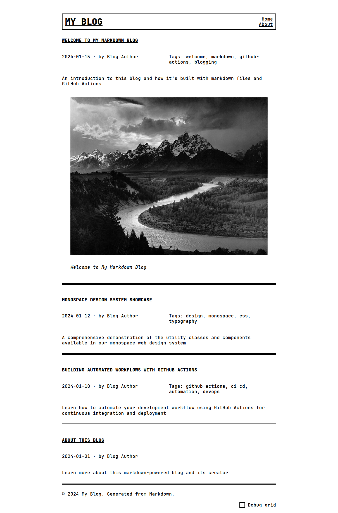

# The Monospace Blog



<style>
@media (max-width: 499px) {
  img[src="screenshot.png"] {
    max-width: 100% !important;
  }
}
</style>

A Python-powered Markdown blog based on [my Python replication](https://github.com/chriscarrollsmith/monospace-web-python) of [The Monospace Web](https://github.com/owickstrom/the-monospace-web) by Oskar Wickström. 

## Quick Start

1. Install [uv](https://docs.astral.sh/uv/getting-started/installation/):
   ```bash
   curl -LsSf https://astral.sh/uv/install.sh | sh
   ```

2. Install Python 3.13+ and other dependencies with uv:
   ```bash
   uv sync
   ```

3. Edit your landing page in `posts/index.md`

4. Edit your blog posts in `posts/`

5. Build the site:
   ```bash
   uv run scripts/build.py
   ```

6. Open `docs/index.html` in a web browser to preview the site.

7. (Optional) Generate a fresh screenshot for documentation:
   ```bash
   uv run scripts/screenshot.py
   ```

## Deployment to GitHub Pages

A Github workflow is configured to automatically build the site in the `docs` folder and commit and push the built files to the remote whenever you push source file changes to `main`.

You will need to enable GitHub Pages for your repository and configure Github Pages to serve the site from the `docs` folder on `main`. You can find these settings in the repository's `Settings > Pages > Build and deployment` section.

## Compatibility with Reprose

This blog generator is designed to work seamlessly with [Reprose](https://repose.pp.ua), an online markdown editor that integrates with GitHub. You can:

1. Write and edit posts directly in Reprose's online editor
2. Push changes to your repository with a button-click
3. Watch as GitHub Actions automatically builds and deploys your blog
4. The frontmatter format is fully compatible with Reprose's standard fields (title, description, date) and supports any additional custom fields you want to add.

## SEO Frontmatter Fields

This blog generator includes comprehensive SEO support through YAML frontmatter fields. You provide the title, description, date, and tags in a frontmatter section at the top of your Markdown post, and the build script will automatically generate HTML page metadata, social graph tags, and a sitemap.

### Example Frontmatter

```yaml
---
title: My Awesome Blog Post
description: A detailed guide to writing great content with SEO optimization
date: 2024-01-15
author: Your Name
tags: [blogging, seo, markdown]
image: https://example.com/featured-image.jpg
---
```

### Supported fields:

#### Required Fields

- **`title`** - Post title (used for page title, Open Graph title, Twitter title)
- **`description`** - Brief post description (used for meta description, Open Graph description, Twitter description)
- **`date`** - Publication date in YYYY-MM-DD format (used for article:published_time meta tag)

#### Optional SEO Fields

- **`author`** - Author name (used for meta author and article:author tags)
- **`image`** - Featured image URL (used for Open Graph image and Twitter Card image)
- **`tags`** - Array of tags (e.g., `[tag1, tag2, tag3]`) (used for article:tag meta tags)
- **`draft`** - Set to `true` to exclude post from build

#### Auto-generated Fields

The build script automatically generates:

- **`slug`** - URL-friendly version of the filename
- **`url`** - Final HTML filename (`{slug}.html`)

## A note on Markdown style

This project's markdown renderer uses the [CommonMark specification](https://commonmark.org/). CommonMark offers a helpful 60-second [tutorial](https://commonmark.org/help/) that you may find helpful if you're new to Markdown.

## License

MIT License - see [LICENSE](LICENSE) for details.
